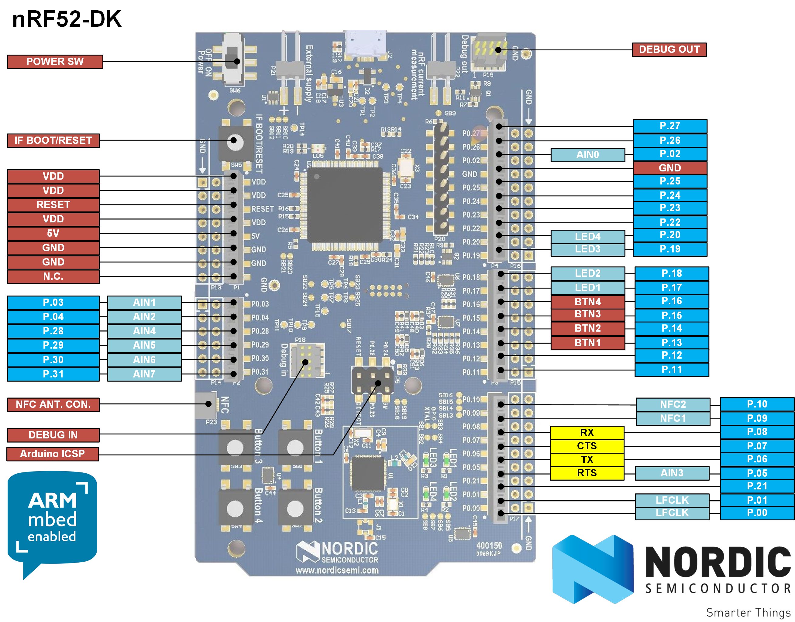

# NRF52832DK

## General Information

ARMmed information <https://developer.mbed.org/platforms/Nordic-nRF52-DK/>

## Activity

There is Activity to support the board in the Espruino community.

## Installation of Espruino

Simple placement of hex in mbed drive.

## Espruino files of interest

* boards:
  * <../boards/NRF52832DK.py>
* pins:
  * none
* targetlibs 
  * <../targetlibs/arm>
  * <../targetlibs/nrf5x>
  * <../targetlibs/nrf5x/nrf52_config>
* targets
  * <../targets/nrf5x>
  * <../targets/nrf5x_dfu>
* Makefile
  * <../Makefile>

## Notes

USE_FILESYSTEM=1 for an SD Card. Requires Makefile change (PR on it's way)